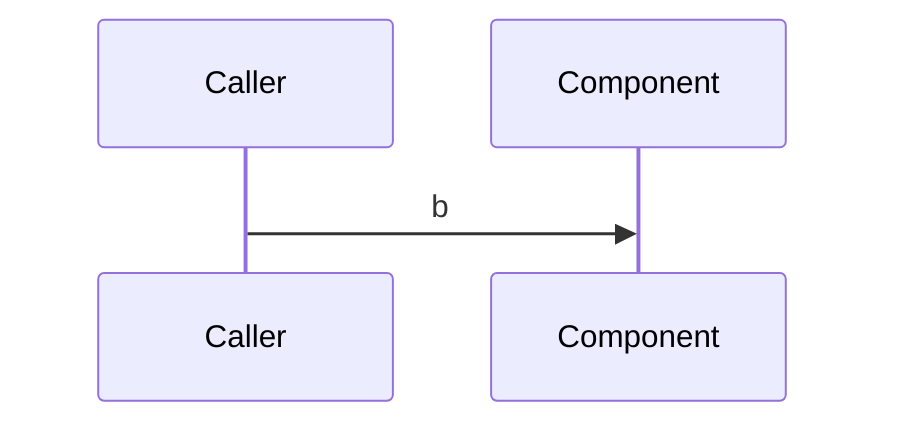

# Flow-map schema and skeletons

Adapt placeholders from real source evidence. Keep project policy alongside this
schema; the validator checks the section/table contract, not all prose obligations.

Required sections: Provenance, Scenarios, Cross-flow scenarios, Runtime applicability,
Symbol index, Invariants, Call graph, Coverage. Diagrams are optional. Use `_none_`
for empty optional content. Scenario IDs use two to four capitals plus two or three
digits; invariant IDs use INV and two or three digits. Table column order can vary
but the complete header set must remain. Use main, alternative or edge classes;
PASS, UNKNOWN or FAIL verdicts. Expand UNKNOWN scenarios with precondition, steps,
outcome and the evidence needed to settle them. Evidence prefixes are code, test,
log, provider-doc or event-capture. Declare evidence availability in Provenance.

Write direct factual prose. Keep uncertainty attached to UNKNOWN; put normative
constraints and their consequences in Invariants. A diagram legend, when included,
must immediately follow its diagram and resolve its symbols and scenario IDs.

## Skeleton — copy from here

````markdown
# Flow — {Flow name} ({FLOW-ID})

## Provenance

- **Flow / session:** {FLOW-ID} · {session id}
- **Mapped at:** `{commit SHA}` on `{branch}`, {YYYY-MM-DD}
- **Owned files (comment pass):** `{repo-root-relative path}`, `{path}`
- **Authority:** authoritative for the scenarios below; onboarding documentation points here.
- **Evidence sources:** {which of code · tests · logs · event capture · runtime measurement were
  AVAILABLE for this flow, and which were not}. Name the unavailable ones explicitly: an absent source
  bounds every verdict below, and silence makes it unreadable whether a source was missing or merely
  unneeded.

## Scenarios

| # | class | trigger | path | verdict | evidence |
|---|---|---|---|---|---|
| {ID}-01 | main | {ordinary event} | `A.b` → `C.d` | PASS | `code: A.b in src/module.py and C.d in src/other.py` |
| {ID}-02 | edge | {race or failure event} | `A.b` → `E.f` | UNKNOWN | `code: A.b returns before caller behavior becomes observable` |

### {ID}-02 — {race or failure event}

**Precondition:** {state established before the trigger}

| # | symbol | does | on failure |
|---|---|---|---|
| 1 | `A.b` | {observed action} | — |
| 2 | `E.f` | {observed action} | {caller-visible result} |

**Outcome:** UNKNOWN.
**Unresolved:** {missing evidence and what would settle it}

## Cross-flow scenarios

| scenario | owning flow | this document's contribution |
|---|---|---|
| {OTHER-ID}-04 | `docs/flows/{other-slug}.md` | {local symbols and outcome contributed here} |

## Runtime applicability

| profile | effective switches | reachable scenarios | unreachable scenarios | evidence |
|---|---|---|---|---|
| production | `{SETTING}=value` | {ID}-01 | {ID}-02 | `code: deploy/production.yaml deploy value` |
| development/local | `{SETTING}=other` | {ID}-01, {ID}-02 | _none_ | `code: deploy/development.yaml and docker-compose.yaml values` |

## Symbol index

| symbol | file | scenarios | called by | invariants |
|---|---|---|---|---|
| `A.b` | `src/module.py` | {ID}-01, {ID}-02 | `X.y` | INV-01 |
| `C.d` | `src/other.py` | {ID}-01 | `A.b` | — |

## Invariants

| # | symbol | constraint | breaks if violated |
|---|---|---|---|
| INV-01 | `A.b` | {constraint that must remain true} | {specific failure consequence} |

## Call graph

| caller | callee | site | scenarios |
|---|---|---|---|
| `X.y` | `A.b` | `src/caller.py` | {ID}-01, {ID}-02 |
| `A.b` | `C.d` | `src/module.py` | {ID}-01 |

## Coverage

| file | scenarios | coverage note |
|---|---|---|
| `src/module.py` | {ID}-01, {ID}-02 | read in full; primary implementation |
| `src/other.py` | {ID}-01 | read in full; reached by C.d |
| `src/caller.py` | {ID}-01, {ID}-02 | read in full; incoming caller |
| `deploy/production.yaml` | {ID}-01, {ID}-02 | read in full; production switches |
| `deploy/development.yaml` | {ID}-01, {ID}-02 | read in full; development switches |
| `docker-compose.yaml` | {ID}-01, {ID}-02 | read in full; local switches |

- **Unmapped symbols:** `{symbol}` — {trivial/dead/missing scenario/UNKNOWN reason}.
- **Unreached subtrees:** `{path}` — {dead/missing scenario/UNKNOWN reason}.
- **Verdict distribution:** PASS {N} · UNKNOWN {N} · FAIL {N}.

## Diagrams



### Legend — nominal call

| participant / node | symbol | file | scenarios |
|---|---|---|---|
| X | `X.y` | `src/caller.py` | {ID}-01 |
| A | `A.b` | `src/module.py` | {ID}-01 |
````

## Risk register

Save as `tasks/BUG-register-flow-<slug>.md`. Its slug matches the owning
`docs/flows/<slug>.md`; finding IDs are local to that slug. Keep the eight required
bullets once per entry. Optional bullets can carry reconciliation details.
Task-path citations must exist at HEAD; cite entries by ID instead of file lines.
Unresolved symbol notes are informational and need manual inspection.

````markdown
### R-{slug}-{nn} · {one-line symptom}
- **Class:** bug | risk | STALE-comment | doc-contradiction | UNKNOWN
- **Severity:** Critical | High | Medium | Low, optionally followed by ` (rationale)`
- **Symbol:** `Class.method` in `src/module.py` — fully qualified, grep-verified at write time
- **Observed:** a scenario id from the owning `docs/flows/{slug}.md`'s `## Scenarios` table that shows
  it, or the literal `**no covering row**` when none does
- **Verdict:** confirmed | suspected | UNKNOWN — and, for an UNKNOWN, what would settle it
- **Reconciled against:** the entry or document that already covers it, cited by `R-{slug}-{nn}` id or
  by path — never by line number
- **Provenance:** `confirmed (author)` | `re-read (<session>, <date>)`
- **No fix proposed.**
````

For seam triage, append a `Residue verdict` bullet naming the pair, symbol and
resolution: seamed-at-row-level, real-gap-row-written, or shared-entry-no-seam.
