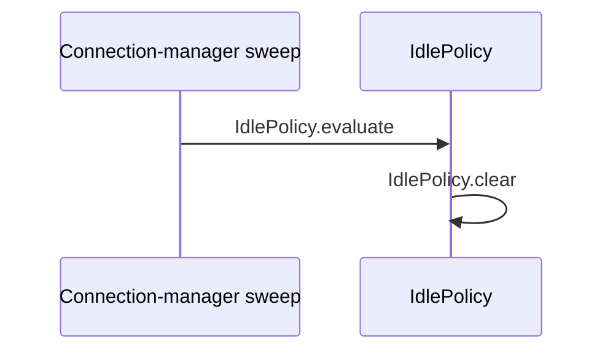

# Flow — Validator nonconformant fixture (CF)

> **SCHEMA FIXTURE — deliberately broken.** This known-positive carries one
> intentional violation for each validator check class. The manifest probes each
> class independently against `conformant.md`.
>
> Intentional violations:
> `sections` missing Cross-flow scenarios; `verdicts` invalid CF-02 class and verdict;
> `distribution` stale count; `symbols` incomplete runtime partition;
> `index` wrong caller for `_reset`; `diagram` unindexed `clear`;
> `evidence` empty CF-02 detail; `tone` one certainty word; `legends` no legend.

## Provenance

- **Flow / session:** CF · validator negative fixture
- **Mapped at:** local fixture state, 2026-09-04
- **Owned files:** _none_; this fixture owns no repository files
- **Authority:** none; this file certifies the checker only

## Scenarios

| # | class | trigger | path | verdict | evidence |
|---|---|---|---|---|---|
| CF-01 | main | an ineligible session is evaluated | `IdlePolicy.evaluate` → `IdlePolicy.is_eligible` → `IdlePolicy._reset` | PASS | `code: src/policy.py resets state when eligibility fails` |
| CF-02 | ordinary | silence is obviously past the warning threshold | `IdlePolicy.evaluate` → `IdlePolicy.is_eligible` → `IdlePolicy.is_silent` → `IdlePolicy._silent_for` → `policy.IdleAction` | handled | `code:` |

## Runtime applicability

| profile | effective switches | reachable scenarios | unreachable scenarios | evidence |
|---|---|---|---|---|
| fixture | `warn_threshold_seconds=15`, `end_threshold_seconds=0` | CF-01 | `_none_` | `code: src/policy.py branches on the effective thresholds` |

## Symbol index

| symbol | file | scenarios | called by | invariants |
|---|---|---|---|---|
| `IdlePolicy.evaluate` | `src/policy.py` | CF-01, CF-02 | `external: connection-manager sweep` | INV-01 |
| `IdlePolicy.is_eligible` | `src/policy.py` | CF-01, CF-02 | `IdlePolicy.evaluate` | — |
| `IdlePolicy._reset` | `src/policy.py` | CF-01 | `external: wrong caller` | — |
| `IdlePolicy.is_silent` | `src/policy.py` | CF-02 | `IdlePolicy.evaluate` | — |
| `IdlePolicy._silent_for` | `src/policy.py` | CF-02 | `IdlePolicy.evaluate` | — |
| `policy.IdleAction` | `src/policy.py` | CF-02 | `IdlePolicy.evaluate` | — |

## Invariants

| # | symbol | constraint | breaks if violated |
|---|---|---|---|
| INV-01 | `IdlePolicy.evaluate` | evaluation should run while the connection-manager lock protects session state | concurrent mutation can corrupt the silence decision |

## Call graph

| caller | callee | site | scenarios |
|---|---|---|---|
| `external: connection-manager sweep` | `IdlePolicy.evaluate` | `src/policy.py` | CF-01, CF-02 |
| `IdlePolicy.evaluate` | `IdlePolicy.is_eligible` | `src/policy.py` | CF-01, CF-02 |
| `IdlePolicy.evaluate` | `IdlePolicy._reset` | `src/policy.py` | CF-01 |
| `IdlePolicy.evaluate` | `IdlePolicy.is_silent` | `src/policy.py` | CF-02 |
| `IdlePolicy.evaluate` | `IdlePolicy._silent_for` | `src/policy.py` | CF-02 |
| `IdlePolicy.evaluate` | `policy.IdleAction` | `src/policy.py` | CF-02 |

## Coverage

| file | scenarios | coverage note |
|---|---|---|
| `src/policy.py` | CF-01, CF-02 | all indexed symbols, call sites, and file evidence live in this fixture file |

**Verdict distribution:** PASS 2 · UNKNOWN 0 · FAIL 0

## Diagrams

