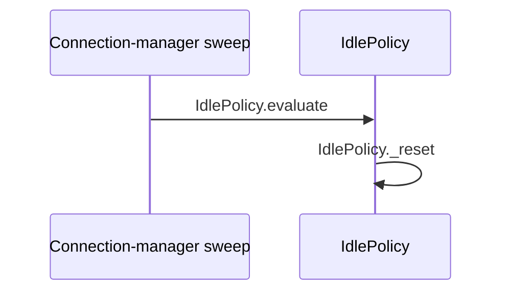

# Flow — Targeted validator fixture (PF)

> **SCHEMA FIXTURE — not runtime documentation.** Targeted checker fixture.

## Provenance

- **Flow / session:** PF · validator fixture
- **Mapped at:** local fixture state, 2026-09-04
- **Authority:** none; this file certifies the checker only

## Scenarios

| # | class | trigger | path | verdict | evidence |
|---|---|---|---|---|---|
| PF-01 | main | an ineligible session is evaluated | `IdlePolicy.evaluate` → `IdlePolicy.is_eligible` → `IdlePolicy._reset` | PASS | `code: src/policy.py resets state when eligibility fails` |

## Cross-flow scenarios

_none_

## Runtime applicability

| profile | effective switches | reachable scenarios | unreachable scenarios | evidence |
|---|---|---|---|---|
| fixture | `warn_threshold_seconds=15`, `end_threshold_seconds=0` | PF-01 | `_none_` | `code: src/policy.py branches on the effective thresholds` |

## Symbol index

| symbol | file | scenarios | called by | invariants |
|---|---|---|---|---|
| `IdlePolicy.evaluate` | `src/policy.py` | PF-01 | `external: connection-manager sweep` | INV-01 |
| `IdlePolicy.is_eligible` | `src/policy.py` | PF-01 | `IdlePolicy.evaluate` | — |
| `IdlePolicy._reset` | `src/policy.py` | PF-01 | `IdlePolicy.evaluate` | — |

## Invariants

| # | symbol | constraint | breaks if violated |
|---|---|---|---|
| INV-01 | `IdlePolicy.evaluate` | evaluation should run while the connection-manager lock protects session state | concurrent mutation can corrupt the silence decision |

## Call graph

| caller | callee | site | scenarios |
|---|---|---|---|
| `external: connection-manager sweep` | `IdlePolicy.evaluate` | `src/policy.py` | PF-01 |
| `IdlePolicy.evaluate` | `IdlePolicy.is_eligible` | `src/policy.py` | PF-01 |
| `IdlePolicy.evaluate` | `IdlePolicy._reset` | `src/policy.py` | PF-01 |

## Coverage

| file | scenarios | coverage note |
|---|---|---|
| `src/policy.py` | PF-01 | indexed symbols, call sites, and local evidence |

**Verdict distribution:** PASS 1 · UNKNOWN 0 · FAIL 0

## Diagrams

### Legend — targeted sequence

| participant / node | symbol | file | scenarios |
|---|---|---|---|
| Sweep | `external: connection-manager sweep` | — | PF-01 |
| WD | `IdlePolicy.evaluate`, `IdlePolicy._reset` | `src/policy.py` | PF-01 |
| Extra | `IdlePolicy.clear` | `src/policy.py` | PF-01 |
