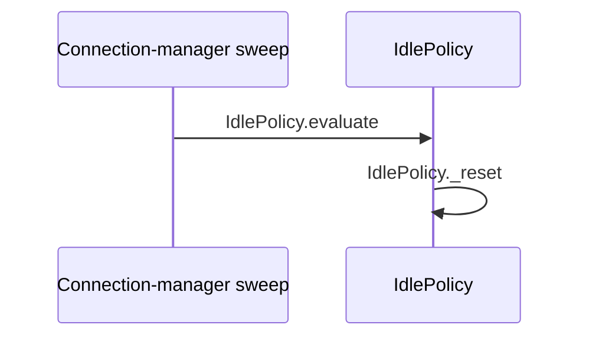
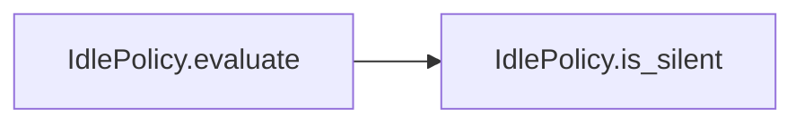

# Flow — Validator conformant fixture (CF)

> **SCHEMA FIXTURE — not runtime documentation.** This known-negative proves that
> `validate_flow_map.py` does not report findings for a complete, internally
> consistent document. The symbol-index columns are reordered as a control for
> header-aware parsing.

## Provenance

## Scenarios

| # | class | trigger | path | verdict | evidence |
|---|---|---|---|---|---|
| CF-01 | main | an ineligible session is evaluated | `IdlePolicy.evaluate` → `IdlePolicy.is_eligible` → `IdlePolicy._reset` | PASS | `code: src/policy.py resets state when eligibility fails` |
| CF-02 | edge | silence reaches the warning threshold | `IdlePolicy.evaluate` → `IdlePolicy.is_eligible` → `IdlePolicy.is_silent` → `IdlePolicy._silent_for` → `policy.IdleAction` | UNKNOWN | `code: src/policy.py returns an action; downstream delivery might depend on an unread caller` |
| CF-03 | alternative | the session leaves eligible scope | `IdlePolicy.evaluate` → `IdlePolicy.is_eligible` → `IdlePolicy._reset` | FAIL | `code: src/policy.py supplies the structural fixture path` |

### CF-02 — warning delivery beyond the fixture boundary

**Precondition:** the policy returns a warning action.

| # | symbol | does | on failure |
|---|---|---|---|
| 1 | `IdlePolicy.evaluate` | returns the action to its caller | delivery might fail outside this fixture's read scope |

**Outcome:** UNKNOWN.
**Unresolved:** read the production caller and its send failure handling.

## Cross-flow scenarios

| scenario | owning flow | this document's contribution |
|---|---|---|
| CS-01 | `scripts/fixtures/flow_map/crossflow_sibling.md` | CF-01 is the eligible-session evaluation this sibling's own path continues into |

## Runtime applicability

| profile | effective switches | reachable scenarios | unreachable scenarios | evidence |
|---|---|---|---|---|
| fixture | `warn_threshold_seconds=15`, `end_threshold_seconds=0` | CF-01, CF-02, CF-03 | `_none_` | `code: src/policy.py branches on the effective thresholds` |
| production without live configuration | `UNKNOWN` | UNKNOWN | UNKNOWN | `code: repository files do not establish this deployed profile and it might differ` |

## Symbol index

| symbol | scenarios | called by | file | invariants |
|---|---|---|---|---|
| `IdlePolicy.evaluate` | CF-01, CF-02, CF-03 | `external: connection-manager sweep` | `src/policy.py` | INV-01 |
| `IdlePolicy.is_eligible` | CF-01, CF-02, CF-03 | `IdlePolicy.evaluate` | `src/policy.py` | — |
| `IdlePolicy._reset` | CF-01, CF-03 | `IdlePolicy.evaluate` | `src/policy.py` | — |
| `IdlePolicy.is_silent` | CF-02 | `IdlePolicy.evaluate` | `src/policy.py` | — |
| `IdlePolicy._silent_for` | CF-02 | `IdlePolicy.evaluate` | `src/policy.py` | — |
| `policy.IdleAction` | CF-02 | `IdlePolicy.evaluate` | `src/policy.py` | — |

## Invariants

| # | symbol | constraint | breaks if violated |
|---|---|---|---|
| INV-01 | `IdlePolicy.evaluate` | evaluation should run while the connection-manager lock protects session state | concurrent mutation can corrupt the silence decision |

## Call graph

| caller | callee | site | scenarios |
|---|---|---|---|
| `external: connection-manager sweep` | `IdlePolicy.evaluate` | `src/policy.py` | CF-01, CF-02, CF-03 |
| `IdlePolicy.evaluate` | `IdlePolicy.is_eligible` | `src/policy.py` | CF-01, CF-02, CF-03 |
| `IdlePolicy.evaluate` | `IdlePolicy._reset` | `src/policy.py` | CF-01, CF-03 |
| `IdlePolicy.evaluate` | `IdlePolicy.is_silent` | `src/policy.py` | CF-02 |
| `IdlePolicy.evaluate` | `IdlePolicy._silent_for` | `src/policy.py` | CF-02 |
| `IdlePolicy.evaluate` | `policy.IdleAction` | `src/policy.py` | CF-02 |

## Coverage

| file | scenarios | coverage note |
|---|---|---|
| `src/policy.py` | CF-01, CF-02, CF-03 | all indexed symbols, call sites, and evidence live in this fixture file |

**Verdict distribution:** PASS 1 · UNKNOWN 1 · FAIL 1

## Diagrams

### Legend — fixture sequence

| participant / node | symbol | file | scenarios |
|---|---|---|---|
| Sweep | `external: connection-manager sweep` | — | CF-01, CF-02, CF-03 |
| WD | `IdlePolicy.evaluate`, `IdlePolicy._reset` | `src/policy.py` | CF-01, CF-03 |

### Legend — warning decision

| participant / node | symbol | file | scenarios |
|---|---|---|---|
| E | `IdlePolicy.evaluate` | `src/policy.py` | CF-02 |
| S | `IdlePolicy.is_silent` | `src/policy.py` | CF-02 |
