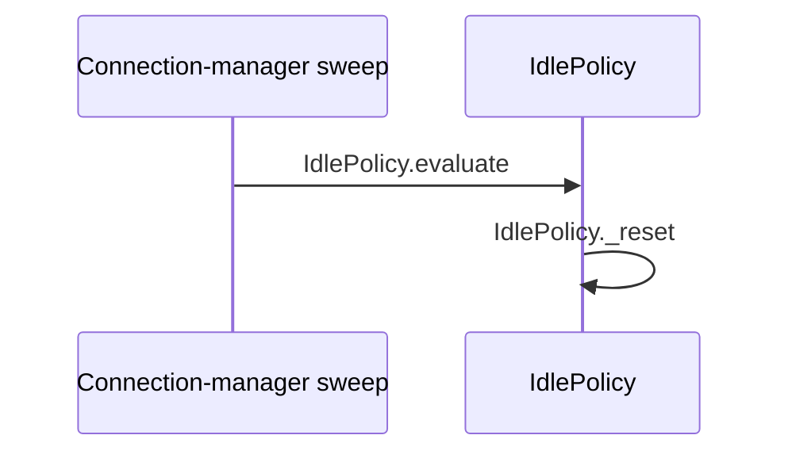

# Flow — Projection generator fixture (FP)

> **GENERATOR FIXTURE — not runtime documentation.** Proves `generate_flow_projections.py`
> certifies a correct document at zero differing rows, and that
> `validate_flow_map.py` reports zero findings against the same file.

## Provenance

- **Flow / session:** FP · generator fixture
- **Mapped at:** local fixture state, 2026-09-06
- **Authority:** none; this file certifies the generator and the checker only

## Scenarios

| # | class | trigger | path | verdict | evidence |
|---|---|---|---|---|---|
| FP-01 | main | an ineligible session is evaluated | `IdlePolicy.evaluate` → `IdlePolicy.is_eligible` → `IdlePolicy._reset` | PASS | `code: src/policy.py resets state when eligibility fails` |
| FP-02 | edge | silence reaches the warning threshold | `IdlePolicy.evaluate` → `IdlePolicy.is_eligible` → `IdlePolicy.is_silent` → `IdlePolicy._silent_for` → `policy.IdleAction` | UNKNOWN | `code: src/policy.py returns an action; downstream delivery might depend on an unread caller` |
| FP-03 | alternative | the session leaves eligible scope | `IdlePolicy.evaluate` → `IdlePolicy.is_eligible` → `IdlePolicy._reset` | FAIL | `code: src/policy.py supplies the structural fixture path` |

### FP-02 — warning delivery beyond the fixture boundary

**Precondition:** the policy returns a warning action.

| # | symbol | does | on failure |
|---|---|---|---|
| 1 | `IdlePolicy.evaluate` | returns the action to its caller | delivery might fail outside this fixture's read scope |

**Outcome:** UNKNOWN.
**Unresolved:** read the production caller and its send failure handling.

## Cross-flow scenarios

_none_

## Runtime applicability

| profile | effective switches | reachable scenarios | unreachable scenarios | evidence |
|---|---|---|---|---|
| fixture | `warn_threshold_seconds=15`, `end_threshold_seconds=0` | FP-01, FP-02, FP-03 | _none_ | `code: src/policy.py branches on the effective thresholds` |

## Symbol index

| symbol | file | scenarios | called by | invariants |
|---|---|---|---|---|
| `IdlePolicy.evaluate` | `src/policy.py` | FP-01, FP-02, FP-03 | `external: connection-manager sweep` | INV-01 |
| `IdlePolicy.is_eligible` | `src/policy.py` | FP-01, FP-02, FP-03 | `IdlePolicy.evaluate` | — |
| `IdlePolicy._reset` | `src/policy.py` | FP-01, FP-03 | `IdlePolicy.evaluate` | — |
| `IdlePolicy.is_silent` | `src/policy.py` | FP-02 | `IdlePolicy.evaluate` | — |
| `IdlePolicy._silent_for` | `src/policy.py` | FP-02 | `IdlePolicy.evaluate` | — |
| `policy.IdleAction` | `src/policy.py` | FP-02 | `IdlePolicy.evaluate` | — |

## Invariants

| # | symbol | constraint | breaks if violated |
|---|---|---|---|
| INV-01 | `IdlePolicy.evaluate` | evaluation should run while the connection-manager lock protects session state | concurrent mutation can corrupt the silence decision |

## Call graph

| caller | callee | site | scenarios |
|---|---|---|---|
| `external: connection-manager sweep` | `IdlePolicy.evaluate` | `src/policy.py` | FP-01, FP-02, FP-03 |
| `IdlePolicy.evaluate` | `IdlePolicy.is_eligible` | `src/policy.py` | FP-01, FP-02, FP-03 |
| `IdlePolicy.evaluate` | `IdlePolicy._reset` | `src/policy.py` | FP-01, FP-03 |
| `IdlePolicy.evaluate` | `IdlePolicy.is_silent` | `src/policy.py` | FP-02 |
| `IdlePolicy.evaluate` | `IdlePolicy._silent_for` | `src/policy.py` | FP-02 |
| `IdlePolicy.evaluate` | `policy.IdleAction` | `src/policy.py` | FP-02 |

## Coverage

| file | scenarios | coverage note |
|---|---|---|
| `src/policy.py` | FP-01, FP-02, FP-03 | all indexed symbols, call sites, and evidence live in this fixture file |
| `src/constants.py` | _none_ | read in full; no cited use in this fixture |

- **Verdict distribution:** PASS 1 · UNKNOWN 1 · FAIL 1.

## Diagrams

### Legend — fixture sequence

| participant / node | symbol | file | scenarios |
|---|---|---|---|
| Sweep | `external: connection-manager sweep` | — | FP-01, FP-02, FP-03 |
| WD | `IdlePolicy.evaluate`, `IdlePolicy._reset` | `src/policy.py` | FP-01, FP-03 |
